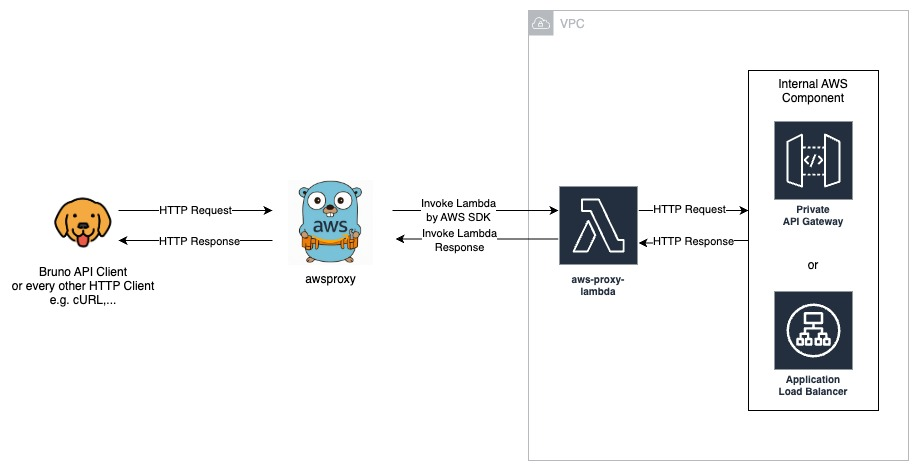

# awsctl proxy

A lightweight proxy tool to access private AWS API Gateways (or other internal http(s) services) from your local machine via a Lambda function inside your VPC.

## Architecture



The local proxy server invokes a Lambda function in your VPC, which forwards requests to your private API Gateway (or other internal AWS components) and returns the response.

## Features

- Access private API Gateways without VPN or Direct Connect
- Simple CLI interface
- Handles all content types (JSON, binary, images, etc.)
- Minimal AWS permissions required
- Easy Terraform deployment

## Installation

### 1. Clone the repository

```bash
git clone https://github.com/jkblume/awsctl
cd awsctl
```

### 2. Install the awsctl CLI

```bash
make install_awsctl
```

This installs the `awsctl` binary to your `$GOPATH/bin`.

### 3. Deploy the Lambda function

Before deploying, configure your variables in `terraform/example/simple/terraform.tfvars`:

```hcl
vpc_id           = "vpc-xxxxx"
vpc_subnet_ids   = ["subnet-xxxxx", "subnet-yyyyy"]
aws_profile_name = "your-profile"
aws_region       = "eu-central-1"
```

Then deploy:

```bash
make deploy_lambda
```

### 4. Start the local proxy

```bash
awsctl proxy \
  -function awsctl-proxy-ingress-lambda \
  -region eu-central-1 \
  -port 8001
```

### 5. Make requests

```bash
# Encode your private API Gateway URL
ENCODED_URL=$(echo -n "https://your-private-api.execute-api.eu-central-1.amazonaws.com" | jq -sRr @uri)

# Make a request
curl -X POST "http://localhost:8001/api_url/${ENCODED_URL}/proxy/your/path"
```

## CLI Options

```
awsctl proxy [options]

Options:
  -function string
        Lambda function name (default "awsctl-proxy-ingress-lambda")
  -region string
        AWS region (default "eu-central-1")
  -profile string
        AWS profile to use (optional)
  -port int
        Local proxy port (default 8001)
  -verbose
        Enable verbose logging (default true)
```

## Terraform Module

The included Terraform module deploys:
- Lambda function with VPC access
- IAM roles and policies
- Security group (allows HTTP/HTTPS to VPC CIDR)
- CloudWatch log group

## How It Works

1. **Local proxy** receives your HTTP request
2. Request body is **base64-encoded** (supports binary data)
3. **Lambda function** is invoked with all provided parameters
4. Lambda **decodes** the body and forwards the request to the private API Gateway
5. Response is **base64-encoded** and returned
6. Local proxy **decodes** and returns the response to your client

## Security

- Lambda requires `lambda:InvokeFunction` permission
- Lambda runs in your VPC with configurable security groups
- No internet gateway required for Lambda
- TLS verification is disabled http requests inside lambda to private internal api
